# AI-Powered Document Intelligence Platform - AWS Architecture Diagram

```mermaid
graph TB
    subgraph "Client Layer"
        User[👤 User Browser]
        API_Client[🔌 API Client<br/>Enterprise Tier]
    end

    subgraph "Vercel Platform"
        subgraph "Flask Application"
            WebApp[🌐 Flask Web Server<br/>api/index.py]
            Auth[🔐 Flask-Login<br/>Session Management]
            Routes[📍 Route Handlers<br/>Upload/Status/Results]
            LLM_Service[🧠 LLM Service<br/>api/llm_service.py<br/>Document Analysis]
            API_Routes[🔌 API Endpoints<br/>/api/v1/*<br/>Enterprise Access]
        end
    end

    subgraph "External Authentication"
        Google[🔑 Google OAuth 2.0<br/>Identity Provider]
    end

    subgraph "Payment Processing"
        Stripe[💳 Stripe<br/>Subscription Management<br/>Free/Pro/Enterprise]
    end

    subgraph "AWS Cloud Services"
        subgraph "Storage Layer"
            S3[📦 Amazon S3<br/>Document Storage<br/>CSV & JSON Results<br/>Presigned URLs]
        end
        
        subgraph "Processing Layer"
            Textract[📄 AWS Textract<br/>OCR Processing<br/>Text Extraction]
            Bedrock[🤖 Amazon Bedrock<br/>Claude 3 Haiku<br/>Intelligent Analysis]
        end
        
        IAM[🔒 AWS IAM<br/>Access Control<br/>S3/Textract/Bedrock]
    end

    subgraph "Database Layer"
        Neon[(🗄️ PostgreSQL<br/>Neon Hosted<br/>User Data & Usage<br/>Document History<br/>API Keys)]
    end

    %% User Interactions
    User -->|HTTPS Requests| WebApp
    User -->|OAuth Flow| Google
    User -->|Payment Flow| Stripe
    API_Client -->|Bearer Token| API_Routes

    %% Application Flow
    WebApp -->|Authenticate| Auth
    WebApp -->|Query/Update| Neon
    WebApp -->|OAuth Callback| Google
    WebApp -->|Create Checkout| Stripe
    Stripe -->|Webhook Events| WebApp
    API_Routes -->|Validate API Key| Neon
    API_Routes -->|Process Request| Routes

    %% AWS Service Interactions
    WebApp -->|Upload Documents| S3
    WebApp -->|Start OCR Job| Textract
    WebApp -->|Invoke LLM Analysis| LLM_Service
    LLM_Service -->|Analyze Text| Bedrock
    WebApp -->|Store JSON Results| S3
    WebApp -->|Generate Download URL| S3
    Textract -->|Read Documents| S3
    Bedrock -->|Return Structured Data| LLM_Service
    IAM -->|Authorize| S3
    IAM -->|Authorize| Textract
    IAM -->|Authorize| Bedrock

    %% Styling
    classDef aws fill:#FF9900,stroke:#232F3E,stroke-width:2px,color:#232F3E
    classDef vercel fill:#000000,stroke:#FFFFFF,stroke-width:2px,color:#FFFFFF
    classDef external fill:#4285F4,stroke:#1967D2,stroke-width:2px,color:#FFFFFF
    classDef database fill:#336791,stroke:#1A3A52,stroke-width:2px,color:#FFFFFF
    classDef user fill:#34A853,stroke:#1E8E3E,stroke-width:2px,color:#FFFFFF

    class S3,Textract,Bedrock,IAM aws
    class WebApp,Auth,Routes,LLM_Service,API_Routes vercel
    class Google,Stripe external
    class Neon database
    class User,API_Client user
```



## Architecture Components

### 1. Client Layer
- **User Browser**: End users interact with the application through web browsers
- **API Client**: Enterprise tier users access via REST API with Bearer token authentication
- **HTTPS**: All communication secured with TLS encryption

### 2. Application Layer (Vercel)
- **Flask Web Server**: Python-based web application with factory pattern
- **Flask-Login**: Manages user sessions and authentication state
- **Route Handlers**: Process uploads, status checks, and result delivery
- **LLM Service** (`api/llm_service.py`): 
  - Orchestrates document analysis with Amazon Bedrock
  - Supports multiple analysis types (general, invoice, contract, form)
  - Generates structured JSON output from extracted text
- **API Endpoints**: RESTful API for Enterprise tier programmatic access
  - `/api/v1/analyze` - Submit documents for processing
  - `/api/v1/status/{job_id}` - Check processing status
  - `/api/v1/result/{job_id}` - Retrieve analysis results

### 3. Authentication & Payments
- **Google OAuth 2.0**: Handles user authentication and identity verification
- **Stripe**: Manages subscription payments across three tiers:
  - Free: 5 docs/month, 2 LLM analyses
  - Pro: 200 docs/month, 50 LLM analyses ($10/month)
  - Enterprise: 1000 docs/month, 500 LLM analyses, API access ($99/month)

### 4. AWS Services
- **Amazon S3**: 
  - Stores uploaded documents
  - Hosts processed CSV files (raw text)
  - Stores JSON files (structured analysis results)
  - Generates presigned URLs for secure downloads
  - Retention policies: 90 days (Free), 365 days (Pro), 730 days (Enterprise)
- **AWS Textract**: 
  - Performs OCR on uploaded documents
  - Extracts text from PDFs and images
  - Supports multi-page documents
  - Async processing with job polling
- **Amazon Bedrock** (NEW):
  - Claude 3 Haiku model for intelligent document analysis
  - Extracts structured data from unstructured text
  - Identifies entities, key terms, and document insights
  - Specialized prompts for different document types
  - Low-temperature inference for consistent results
- **AWS IAM**: 
  - Controls access permissions for S3, Textract, and Bedrock
  - Secures service-to-service communication
  - Enforces least-privilege access

### 5. Database Layer
- **PostgreSQL (Neon)**: 
  - Stores user profiles and OAuth data
  - Tracks usage metrics for freemium limits (documents + LLM analyses)
  - Manages subscription status and tier information
  - Document history with metadata (filename, type, processing time)
  - API key storage for Enterprise users (hashed)

## Data Flow

### Document Processing Flow (with LLM Analysis)
1. User uploads document via web interface
2. User selects analysis type (general/invoice/contract/form) and enables LLM
3. Flask app checks user quota (documents + LLM analyses remaining)
4. Flask app stores document in S3
5. Flask app initiates Textract OCR job
6. Textract reads document from S3 and processes
7. Flask app polls for job completion
8. **[NEW]** If LLM enabled: Flask invokes LLM Service with extracted text
9. **[NEW]** LLM Service sends text to Amazon Bedrock (Claude 3 Haiku)
10. **[NEW]** Bedrock returns structured JSON analysis
11. **[NEW]** Flask stores JSON results to S3
12. Flask saves CSV (raw text) to S3
13. **[NEW]** Flask saves document metadata to database (history table)
14. User views results in tabbed interface (Text + Analysis)
15. User downloads CSV and/or JSON via presigned URLs

### Authentication Flow
1. User clicks "Login with Google"
2. Redirected to Google OAuth consent screen
3. Google returns authorization code
4. Flask exchanges code for user profile
5. User session created with Flask-Login
6. User data stored/updated in PostgreSQL
7. Usage counters initialized (documents, LLM analyses)

### Payment Flow
1. User clicks upgrade to Pro or Enterprise
2. Flask creates Stripe checkout session with appropriate price ID
3. User completes payment on Stripe
4. Stripe sends webhook to Flask
5. Flask updates user subscription status in database
6. User quota limits updated based on new tier
7. **[NEW]** Enterprise users can generate API keys

### API Flow (Enterprise Only)
1. Client sends POST request to `/api/v1/analyze` with Bearer token
2. Flask validates API key against database
3. Flask checks Enterprise tier and rate limits (100 req/hour)
4. Document processed through standard OCR + LLM pipeline
5. Flask returns job ID and status URL
6. Client polls `/api/v1/status/{job_id}` for completion
7. Client retrieves results from `/api/v1/result/{job_id}`
8. Response includes CSV URL, JSON URL, and structured analysis data

### LLM Analysis Decision Flow
1. Check if user enabled "AI Analysis" toggle
2. Verify user has LLM analyses remaining in quota
3. Determine analysis type from user selection or auto-detect
4. Select specialized prompt template:
   - **General**: Summary, key points, entities, document type
   - **Invoice**: Vendor, amounts, line items, dates, tax
   - **Contract**: Parties, terms, obligations, important clauses
   - **Form**: Field extraction, completeness, structured data
5. Send prompt + extracted text to Bedrock
6. Parse and validate JSON response
7. Increment user's LLM usage counter
8. Store results and return to user

## AI Agent Capabilities

This application demonstrates autonomous AI agent behavior through:

### 1. Autonomous Decision Making
- Automatically selects appropriate analysis strategy based on document type
- Determines optimal prompt template without human intervention
- Manages quota enforcement and tier-based feature access

### 2. Complex Task Execution
- Orchestrates multi-service workflow: S3 → Textract → Bedrock → S3
- Handles async processing with intelligent polling
- Manages error recovery and retry logic

### 3. Intelligent Reasoning
- Uses Claude 3 Haiku to understand document context
- Extracts structured insights from unstructured text
- Identifies entities, relationships, and key information
- Adapts analysis depth based on document complexity

### 4. Self-Service Operation
- Processes documents end-to-end without human intervention
- Automatically stores results and generates download links
- Maintains document history and usage tracking
- Handles payment webhooks and tier upgrades autonomously

## Cost Analysis

### Per-Document Processing Costs

| Service | Cost per Document | Notes |
|---------|------------------|-------|
| AWS Textract | $0.0015 | 1 page average |
| Amazon Bedrock (Claude 3 Haiku) | $0.0001 | ~400 tokens input/output |
| S3 Storage | $0.000023 | Per MB per month |
| **Total with LLM** | **~$0.0016** | Per document with AI analysis |
| **Total without LLM** | **~$0.0015** | OCR only |

### Profitability by Tier

| Tier | Monthly Price | Max Docs | Max LLM | AWS Cost | Margin |
|------|--------------|----------|---------|----------|--------|
| Free | $0 | 5 | 2 | $0.0083 | -100% (acquisition) |
| Pro | $10 | 200 | 50 | $0.38 | 96.2% |
| Enterprise | $99 | 1000 | 500 | $1.88 | 98.1% |

**Note**: Margins assume maximum usage. Actual margins are higher due to typical usage patterns.

## Security Considerations

### Data Protection
- All documents encrypted in transit (HTTPS) and at rest (S3 encryption)
- Presigned URLs expire after 5 minutes
- API keys hashed using cryptography library
- No document content stored in database

### Access Control
- IAM policies enforce least-privilege access
- API rate limiting (100 requests/hour per key)
- Tier-based feature gating
- Session management with secure cookies

### Compliance
- GDPR-ready with data retention policies
- User data deletion on account closure
- Audit trail in database for all operations
- Webhook signature verification for Stripe events

## Scalability

### Current Architecture
- **Vercel**: Serverless auto-scaling for web tier
- **AWS Services**: Managed services with automatic scaling
- **Neon PostgreSQL**: Connection pooling and auto-scaling storage
- **S3**: Unlimited storage capacity

### Performance Characteristics
- **OCR Processing**: 2-5 seconds per page (Textract)
- **LLM Analysis**: 1-3 seconds per document (Bedrock)
- **Total Processing**: 3-8 seconds for typical document
- **API Response**: <100ms for status checks
- **Download Speed**: Limited by S3 presigned URL bandwidth

### Bottlenecks & Mitigation
- **Database Connections**: Neon connection pooling handles concurrent users
- **Textract Rate Limits**: Async processing with job queuing
- **Bedrock Rate Limits**: 10,000 requests/minute (well above needs)
- **S3 Rate Limits**: 5,500 PUT/s per prefix (no practical limit)


## Technology Stack Summary

### Frontend
- **Jinja2 Templates**: Server-side rendering
- **Vanilla JavaScript**: AJAX polling, dynamic UI updates
- **Font Awesome**: Icons and UI elements
- **CSS**: Inline styling for simplicity

### Backend
- **Flask**: Web framework with application factory pattern
- **Flask-Login**: Session management and authentication
- **Flask-SQLAlchemy**: ORM for PostgreSQL
- **boto3**: AWS SDK for Python (S3, Textract, Bedrock)
- **python-dotenv**: Environment variable management

### AWS Services
- **Amazon S3**: Document and result storage
- **AWS Textract**: OCR text extraction
- **Amazon Bedrock**: LLM-powered document analysis (Claude 3 Haiku)
- **AWS IAM**: Access control and security

### External Services
- **Google OAuth 2.0**: User authentication
- **Stripe**: Payment processing and subscriptions
- **Neon**: Managed PostgreSQL hosting
- **Vercel**: Application hosting and deployment

### Development Tools
- **Python 3.9+**: Programming language
- **pip**: Package management
- **venv**: Virtual environment
- **AWS CLI**: AWS service testing (optional)

## Deployment Architecture

### Production Environment (Vercel)
```
User Request → Vercel Edge Network → Flask App (Serverless) → AWS Services
                                                            → PostgreSQL (Neon)
                                                            → External APIs
```

### Environment Variables Required
- `AWS_ACCESS_KEY_ID`, `AWS_SECRET_ACCESS_KEY`, `AWS_REGION`
- `S3_BUCKET`
- `GOOGLE_CLIENT_ID`, `GOOGLE_CLIENT_SECRET`
- `STRIPE_SECRET_KEY`, `STRIPE_PUBLISHABLE_KEY`, `STRIPE_WEBHOOK_SECRET`
- `STRIPE_SUBSCRIPTION_PRICE_ID`, `STRIPE_ENTERPRISE_PRICE_ID`
- `DATABASE_URL`
- `SECRET_KEY`

### Monitoring & Observability
- **Vercel Logs**: Application logs and errors
- **AWS CloudWatch**: Service-level metrics (Textract, Bedrock)
- **Stripe Dashboard**: Payment and subscription analytics
- **Database Metrics**: Query performance and connection pooling (Neon)

## Future Enhancements

### Planned Features
1. **Multi-language OCR**: Support for non-English documents
2. **Batch Processing**: Upload and process multiple documents at once
3. **Webhook Notifications**: Real-time alerts when processing completes
4. **Custom Prompts**: Enterprise users can define custom analysis templates
5. **Document Comparison**: Diff analysis between document versions
6. **Advanced Analytics**: Dashboard with usage trends and insights

### Technical Improvements
1. **Caching Layer**: Redis for frequently accessed results
2. **Queue System**: SQS for better async job management
3. **CDN Integration**: CloudFront for faster global access
4. **Multi-region**: Deploy to multiple AWS regions for lower latency
5. **Database Optimization**: Read replicas for history queries
6. **API Versioning**: Support multiple API versions for backward compatibility

### AI/ML Enhancements
1. **Multi-model Support**: GPT-4, Gemini, or custom models
2. **Fine-tuning**: Custom Claude models for specific document types
3. **Confidence Scores**: Quality metrics for extracted data
4. **Auto-classification**: Automatic document type detection
5. **Entity Linking**: Connect extracted entities to knowledge bases
6. **Summarization**: Multi-document summarization and comparison
